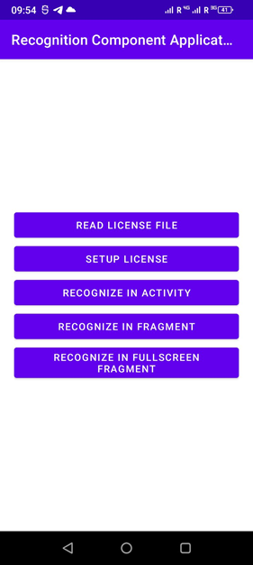
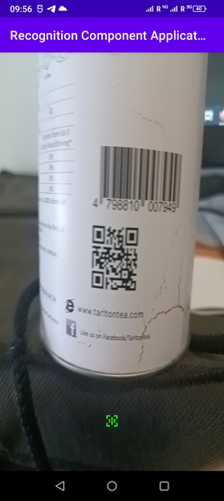
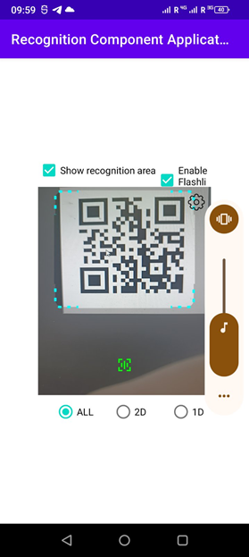
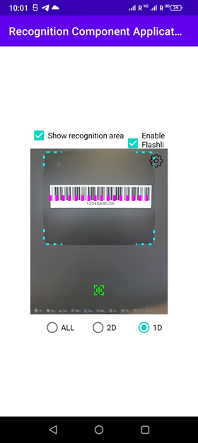
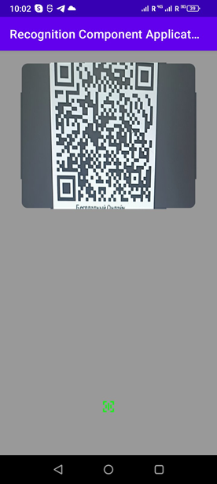
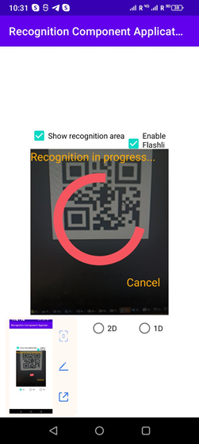

# How to use Barcode Recognition Component

## Introduction
*Barcode Recognition Component* (**BRC**) is a part of the *Aspose Barcode for Android via Java* product.  
It provides an API for integration into the GUI client module for barcode scanning and recognition.  
**BRC** is a module that provides the image from the camera to a GUI component. Upon pressing the recognition button, it captures the image from the camera and attempts to recognise the barcode from the camera.
**BRC** provides the API that allows the use of the component in two ways:
1. **BRC** can be used in application as an independent activity. The client can launch the **BRC** as a separate service. The activity will perform scanning and return the result.
2. **BRC** can be integrated into the client's GUI as a `Fragment`. In this case, the client will be able to perform a more detailed customization of the component.

### Base customization parameters of BRC:
1. **BRC** can be configured both in Java code and in layout files.
2. **BRC** provides API for accessing to all BarcodeReader settings, so all recognition settings can be configured.
3. **BRC** provides API for barcode recognition on the entire image or recognition on the bounding area. This option provides the possibility to customize the GUI for the barcode recognition area:
- Size of the area
- Drawing markers for recognition:
- Line for 1D barcodes
- Rectangular frame for 2D barcodes
- Color filters for the recognition area and the frame.

## Content:
1. Using **BRC** as a `Fragment`.
2. Using **BRC** as an `Activity`.
3. Setting up a *Recognition Settings*.
4. Configuring a *Barcode Recognition Area*.
5. Setting up animation during the recognition process.
6. Using of the **BRC Example App**

## 1. Using BRC as a Fragment
In this usage scenario, **BRC** is presented as a class BarcodeScannerFragment, which should be added to the custom GUI.  
The BarcodeScannerFragment class extends the `androidx.fragment.app.Fragment` class,  
so properties of the parent `Fragment` class can be used to configure the size and location of the component on the GUI.  
`BarcodeScannerFragment` provides extended settings for recognition and GUI customization.  
For processing the results of recognition should be added custom implementation of 'BarcodeRecognitionResultsHandler'.

### The main scenario of BarcodeScannerFragment contains next steps:
1. `BarcodeScannerFragment` is initialized according to the GUI and recognition settings.
2. **BRC** starts the camera and displays the image streamed from camera within custom defined rendering of the area.
3. Upon pressing the button, `BarcodeScannerFragment` captures an image from the camera and starts barcode recognition of the image.
4. The GUI stops streaming from the camera and, during recognition, launches a waiting fragment for the recognition result.
5. After completing the recognition stage, **BRC** calls the custom defined handler for processing of the recognition result.  
   Features of using **BRC** as a `BarcodeScannerFragment`:  
   • `BarcodeScannerFragment` provides the API for extended customization of the GUI.  
   • `BarcodeScannerFragment` requires more detailed initial setup.  
   • The client can configure and use `BarcodeScannerPreferencesFragment` (GUI for user settings accessed by pressing the **Settings** button).  
   • `BarcodeScannerFragment` can be configured directly in the code and in the GUI layout file.  
   • When using `BarcodeScannerFragment`, the lifecycle of fragments must be considered.  
   • When using **BRC** as a fragment, configuring and applying camera permissions must be implemented in the custom code.

Be sure to include to your `gradle dependencies`
```groovy  
implementation 'androidx.constraintlayout:constraintlayout:2.1.4'  
```  

**BarcodeScannerFragment usage example:**  
To add `BarcodeScannerFragment` to the user interface (GUI), customer should to include it in the corresponding layout file:
```xml  
<androidx.fragment.app.FragmentContainerView  
android:id="@+id/fragmentBarcodeScannerContainerView"  
android:tag="barcode_scanner_fragment_tag"  
android:layout_width="match_parent"  
android:layout_height="match_parent" android:name="com.aspose.barcode.component.barcodescanner.BarcodeScannerFragment"  
tools:layout="@layout/fragment_barcode_camera" />  
```  
To set up a new `BarcodeScannerFragment` within an existing 'FragmentContainerView', customer should add the following code:
```java  
BarcodeScannerFragment barcodeScannerFragment = new BarcodeScannerFragment();  
requireActivity().getSupportFragmentManager().beginTransaction().add(R.id.fragmentBarcodeScannerContainerView, barcodeScannerFragment).commit();  
```  
To access an instance of the `BarcodeScannerFragment` class that was created earlier:
```java  
BarcodeScannerFragment barcodeScannerFragment = (BarcodeScannerFragment) getChildFragmentManager().findFragmentByTag("full_screen_barcode_scanner_fragment_tag");  
```  
**BRC** contains a `BarcodeScannerPreferencesFragment` class, that provides the API to add a custom GUI for custom settings.  
The `BarcodeScannerPreferencesFragment` class is abstract class, that extends from `androidx.preference.PreferenceFragmentCompat`, so the custom implementation of `BarcodeScannerPreferencesFragment` should be implemented according to the specification for inheriting from `PreferenceFragmentCompat`.  
`BarcodeScannerPreferencesFragment` provides the protected final method `BarcodeRecognitionSettings getBarcodeScannerFragmentPreferences()`, which provides access to the settings of `BarcodeScannerFragment` (This method can only be accessed after the `onViewCreated` method is executed).  
As mentioned earlier, `BarcodeScannerPreferencesFragment` is invoked by pressing the **Settings** button. After pressing the **Settings** button, **BRC** switches to custom implementation of `BarcodeScannerPreferencesFragment`  
To invoke the custom `BarcodeScannerPreferencesFragment`, customer should to set the `showPreferencesButton` flag to true and add the custom implementation of `BarcodeScannerPreferencesFragment` to the `BarcodeScannerFragment`:
```java  
BarcodeScannerFragment barcodeScannerFragment = (BarcodeScannerFragment) getChildFragmentManager().findFragmentByTag("barcode_scanner_fragment_tag");  
barcodeScannerFragment.setPreferencesFragment(new ClientSettingsFragment());  
barcodeScannerFragment.setShowPreferencesButton(true);  
```  
Here's an example custom implementation of `BarcodeScannerPreferencesFragment`:
```java  
public class ClientSettingsFragment extends BarcodeScannerPreferencesFragment  
{  
private static final String ALL_SUPPORTED_TYPES_TITLE_NAME = "All Supported Types";  
private static final String ONE_D_TYPES_TITLE_NAME = "1D";  
private static final String TWO_D_TYPES_TITLE_NAME = "2D";  
  
@Override  
public void onCreatePreferences(Bundle savedInstanceState, String rootKey) {  
setPreferencesFromResource(R.xml.client_preferences, rootKey);  
}  
  
@Override  
public void onViewCreated(@NonNull View view, @Nullable Bundle savedInstanceState)  
{  
super.onViewCreated(view, savedInstanceState);  
  
initControls(getBarcodeScannerFragmentPreferences());  
}  
  
public void initControls(BarcodeRecognitionSettings scannerPreferences)  
{  
// Decode types  
ListPreference decodeTypesListPreference = findPreference("decode_types_list_preference");  
initDecodeTypes(decodeTypesListPreference);  
decodeTypesListPreference.setVisible(true);  
  
// Resolutions  
ListPreference resolutionListPreference = findPreference("resolution_list_preference");  
try {  
initResolutions(resolutionListPreference);  
resolutionListPreference.setVisible(true);  
}  
catch (CameraAccessException e)  
{  
throw new RuntimeException(e);  
}  
  
// Show recognition area  
SwitchPreferenceCompat switchPreference = findPreference("show_recognition_area");  
switchPreference.setChecked(scannerPreferences.getBarcodeScannerFragmentSettings().getCameraProcessingFragmentSettings().getRecognitionAreaSettings().isRecognizeOnlyInRecognitionArea());  
switchPreference.setOnPreferenceChangeListener((preference, newValue) -> {  
boolean isShowRecognitionArea = (Boolean)newValue;  
scannerPreferences.getBarcodeScannerFragmentSettings().getCameraProcessingFragmentSettings().getRecognitionAreaSettings().setRecognizeOnlyInRecognitionArea((isShowRecognitionArea));  
switchPreference.setChecked(isShowRecognitionArea);  
getBarcodeScannerFragmentPreferences().getBarcodeScannerFragmentSettings().getCameraProcessingFragmentSettings().getRecognitionAreaSettings().setRecognizeOnlyInRecognitionArea(isShowRecognitionArea);  
return true;  
});  
switchPreference.setVisible(true);  
}  
  
private void initDecodeTypes(ListPreference decodeTypePreference)  
{  
List<String> entries = Arrays.asList(ALL_SUPPORTED_TYPES_TITLE_NAME, ONE_D_TYPES_TITLE_NAME, TWO_D_TYPES_TITLE_NAME);  
decodeTypePreference.setEntries(entries.toArray(new String[0]));  
decodeTypePreference.setEntryValues(entries.toArray(new String[0]));  
decodeTypePreference.setTitle(getDecodeTypeTitle(getBarcodeScannerFragmentPreferences().getBarCodeDecodeType()));  
decodeTypePreference.setValueIndex(0);  
decodeTypePreference.setOnPreferenceChangeListener((preference, newValue) ->  
{  
BaseDecodeType chosenDecodeType = getBarcodeScannerFragmentPreferences().getBarCodeDecodeType();  
if (ALL_SUPPORTED_TYPES_TITLE_NAME.equals(newValue))  
{  
chosenDecodeType = DecodeType.ALL_SUPPORTED_TYPES;  
}  
else if (ONE_D_TYPES_TITLE_NAME.equals(newValue))  
{  
chosenDecodeType = DecodeType.TYPES_1D;  
}  
else if (TWO_D_TYPES_TITLE_NAME.equals(newValue))  
{  
chosenDecodeType = DecodeType.TYPES_2D;  
}  
decodeTypePreference.setTitle(getDecodeTypeTitle(chosenDecodeType));  
getBarcodeScannerFragmentPreferences().setBarCodeReadType(chosenDecodeType);  
return true;  
});  
}  
  
public void initResolutions(ListPreference resolutionListPreference) throws CameraAccessException  
{  
List<String> entries = new ArrayList<>();  
List<Size> availableResolutions = Arrays.asList(getCameraResolutions(requireContext()));  
availableResolutions.sort(Comparator.comparingInt(o -> o.getWidth() * o.getHeight()));  
Size chosenResolution = getBarcodeScannerFragmentPreferences().getBarcodeScannerFragmentSettings().getCameraProcessingFragmentSettings().getCameraResolution() == null ? availableResolutions.get(0) :  
getBarcodeScannerFragmentPreferences().getBarcodeScannerFragmentSettings().getCameraProcessingFragmentSettings().getCameraResolution();  
availableResolutions.forEach(resolution -> entries.add(resolution.getWidth() + "x" + resolution.getHeight()));  
resolutionListPreference.setEntries(entries.toArray(new String[0]));  
resolutionListPreference.setEntryValues(entries.toArray(new String[0]));  
resolutionListPreference.setTitle(chosenResolution.getWidth() + "x" + chosenResolution.getHeight());  
resolutionListPreference.setValueIndex(0);  
resolutionListPreference.setOnPreferenceChangeListener((preference, newValue) ->  
{  
String titleResolution = (String)newValue;  
Size newResolution = new Size(Integer.parseInt(titleResolution.split("x")[0]),Integer.parseInt(titleResolution.split("x")[1]));  
resolutionListPreference.setTitle(newResolution.getWidth() + "x" + newResolution.getHeight());  
getBarcodeScannerFragmentPreferences().getBarcodeScannerFragmentSettings().getCameraProcessingFragmentSettings().setCameraResolution(newResolution);  
return true;  
});  
getBarcodeScannerFragmentPreferences().getBarcodeScannerFragmentSettings().getCameraProcessingFragmentSettings().setCameraResolution(chosenResolution);  
}  
private static String getDecodeTypeTitle(BaseDecodeType decodeType)  
{  
if (decodeType instanceof MultyDecodeType && ((MultyDecodeType) decodeType).containsAll(DecodeType.ALL_SUPPORTED_TYPES))  
return ALL_SUPPORTED_TYPES_TITLE_NAME;  
if (decodeType instanceof MultyDecodeType && ((MultyDecodeType) decodeType).containsAll(DecodeType.TYPES_1D))  
return ONE_D_TYPES_TITLE_NAME;  
if (decodeType instanceof MultyDecodeType && ((MultyDecodeType) decodeType).containsAll(DecodeType.TYPES_2D))  
return TWO_D_TYPES_TITLE_NAME;  
return ALL_SUPPORTED_TYPES_TITLE_NAME;  
}  
public static android.util.Size[] getCameraResolutions(Context context) throws CameraAccessException  
{  
CameraManager cameraManager = ((CameraManager) context.getSystemService(Context.CAMERA_SERVICE));  
StreamConfigurationMap configurationMap = cameraManager.getCameraCharacteristics(String.valueOf(0)).get(CameraCharacteristics.SCALER_STREAM_CONFIGURATION_MAP);  
return configurationMap.getOutputSizes(ImageFormat.JPEG);  
}  
}  
```  
## 2. Using BRC as an Activity
In this usage scenario, **BRC** will be launched as a standalone module, that provides the possibility to customize recognition settings, GUI settings, and a recognition result handler. The **BRC** activity is built around the BarcodeScannerFragment, so the base scenario of BarcodeScannerFragment forms the basis of the `BarcodeScannerActivity`'s scenario.  
When using **BRC** as an activity, the main scenario of **BRC** can be outlined as follows:
1. **BRC** is initialized with the customers settings.
2. **BRC** launches the `BarcodeScannerActivity`.
3. `BarcodeScannerActivity` launches `BarcodeScannerFragment` within itself, so the scanning and recognition stages are identical to those in `BarcodeScannerFragment`:  
   3.1 `BarcodeScannerFragment` is initialized in according to the GUI and recognition settings.  
   3.2 **BRC** starts the camera and displays the camera image within the area defined by `BarcodeScannerFragment` (`BarcodeScannerFragment` is fullscreen in this case, because `BarcodeScannerActivity` is fullscreen).  
   3.3 Upon pressing the button, `BarcodeScannerFragment` captures an image from the camera and starts barcode recognition on the image.  
   3.4 The GUI stops streaming from the camera and, during recognition, launches a waiting fragment for the recognition result.
4. After completing the recognition stage, **BRC** calls the implemented by customer `BarcodeRecognitionResultsHandler`.
5. Upon completion of the operation, the customers `BarcodeRecognitionResultsHandler` should return a flag indicating whether to repeat the scanning (Scenario of **BRC** move to step 3) or close the activity and return the result to the customer activity.

*Features of using **BRC** as an Activity:*  
• Less client code is needed to launch and configure **BRC**.  
• There's no need to embed **BRC** into the client's GUI and configure it.  
• The central class of **BRC** activity, `BarcodeScannerActivity`, should be initialized in the `onCreate` method of the client's `Activity`.  
• `BarcodeScannerActivity` should be registered in the client's *AndroidManifest* file.

Here's **BRC** usage example using Activity API. `BarcodeScannerActivity` should be registered in the *AndroidManifest* file:
```xml  
<activity  
android:name="com.aspose.barcode.component.barcodescanner.BarcodeScannerActivity"  
android:exported="true">  
</activity>  
```  

The `BarcodeScanner` class should be initialized in the onCreate() method of your client Activity to register BarcodeScannerActivity:
```java  
@Override  
protected void onCreate(Bundle savedInstanceState)  
{  
super.onCreate(savedInstanceState);  
  
try  
{  
BarcodeScanner scanner = new BarcodeScanner(this);  
}  
catch (CameraAccessException e)  
{  
e.printStackTrace();  
}  
}  
```  
`BarcodeScannerPreferences` is the base class for `BarcodeScanner` customization. Accessing to the settings can be done as follows:
```java  
BarcodeScanner scanner = new BarcodeScanner(this);  
BarcodeScannerPreferences preferences = scanner.getPreferences();  
```  
`BarcodeScannerPreferences` contains the following settings:  
• `IsRotationEnabled`: allows blocking screen rotation.  
• `BarcodeRecognitionSettings`: provides an API for recognition and GUI settings.  
After scanning, the recognition result should be processed. This processing can be divided into 2 stages:
1. Processing the recognition result within `BarcodeScannerActivity`. To do this, you need to implement the `BarcodeRecognitionResultsHandlerParcelable` interface. This interface serves as a transport container for passing data between activities by implementing the `Parcelable` interface.  
   The `BarcodeRecognitionResultsHandlerParcelable` interface contains one method:
```java  
boolean processResult(Context context, BarCodeResult[] results, BarcodeSettings settings);  
```  
In the implementation of this method, you can process the recognition results (`BarCodeResult[] results`), make changes to the settings (`BarcodeSettings settings`), and depending on the recognition result, return true if scanning needs to be repeated or `false` if scanning is completed and you need to return to the client activity.  
Recognition results can be saved in a convenient format for the client and returned to the client activity by implementing the `Parcelable` interface.  
Here's an example implementation of `BarcodeRecognitionResultsHandlerParcelable`:
```java  
public class ClientResultsHandler implements BarcodeRecognitionResultsHandlerParcelable  
{  
public String resultString;  
  
public ClientResultsListener() {}  
  
protected ClientResultsListener(Parcel in) {  
resultString = in.readString();  
}  
  
@Override  
public void writeToParcel(Parcel dest, int flags) {  
dest.writeString(resultString);  
}  
  
@Override  
public int describeContents() {  
return 0;  
}  
  
public static final Creator<ClientResultsListener> CREATOR = new Creator<ClientResultsListener>() {  
@Override  
public ClientResultsListener createFromParcel(Parcel in) {  
return new ClientResultsListener(in);  
}  
  
@Override  
public ClientResultsListener[] newArray(int size) {  
return new ClientResultsListener[size];  
}  
};  
  
@Override  
public boolean processResult(Context context, BarCodeResult[] results, BarcodeSettings settings)  
{  
if(results == null || results.length < 1)  
{  
AlertDialog.Builder dialog = new AlertDialog.Builder(context);  
dialog.setMessage("Cannot recognize Barcode Image");  
dialog.create().show();  
return true;  
}  
  
resultString = results[0].getCodeText();  
return false;  
}  
}  
```  
2. After completing of the scanning (the `BarcodeRecognitionResultsHandlerParcelable.processResult()` method returned false), `BarcodeScanner` closes its activity and returns control to the activity from which it was called. At this stage, it invokes the scanning completion handler, which should implement the `OnBarcodeScannerCompletedCallback` interface. It also invokes the recognition completion handler, which should implement the `OnBarcodeRecognitionCompletedCallback` interface:
```java  
void onScanFinished(BarcodeRecognitionResultsHandlerParcelable barcodeRecognitionResult);  
```  
In this handler, the `BarcodeRecognitionResultsHandlerParcelable` is passed as an argument (which will contain the scanning results, as described in step 1).  
Here's an example implementation of `OnBarcodeScannerCompletedCallback`:
```java  
barcodeScanner.setOnBarcodeScannerCompletedCallback(new OnBarcodeScannerCompletedCallback()  
{  
@Override  
public void onScanFinished(BarcodeRecognitionResultsHandlerParcelable barcodeRecognitionResult)  
{  
String message = ((ClientResultsHandler) barcodeRecognitionResult).resultString;  
if(message != null && message.length() > 0)  
{  
AlertDialog.Builder dialog = new AlertDialog.Builder(requireContext());  
dialog.setMessage(message);  
dialog.create().show();  
}  
}  
});  
```  
## 3. Setting up BarcodeScannerFragment
To configure the recognition parameters and customize the GUI in `BarcodeScannerFragment`, customer should call the method `BarcodeScannerFragment.getBarcodeScannerFragmentPreferences()`, which will return `BarcodeRecognitionSettings`. The `BarcodeRecognitionSettings` class allows you to configure recognition parameters and customize the GUI:  
• To configure the GUI, call the method `BarcodeRecognitionSettings.getBarcodeScannerFragmentSettings()`, which will return `BarcodeScannerFragmentSettings`.  
• The recognition result handler is set using `BarcodeRecognitionSettings.setRecognitionResultsHandler()`.  
• Recognition settings are configured using methods such as `setBarCodeReadType(SingleDecodeType... barcodeTypes)`, `getQualitySettings()`, `setQualitySettings()`, and `getBarcodeSettings()`.

Here's an example of setting up `BarcodeScannerFragment`:
```java  
BarcodeRecognitionSettings barcodeRecognitionSettings = barcodeScannerFragment.getBarcodeRecognitionSettings();  
  
barcodeRecognitionSettings.getBarcodeScannerFragmentSettings().getCameraProcessingFragmentSettings().getRecognitionAreaSettings().setRecognizeOnlyInRecognitionArea(true);  
barcodeRecognitionSettings.setBarCodeReadType(DecodeType.QR);  
barcodeRecognitionSettings.getBarcodeScannerFragmentSettings().getCameraProcessingFragmentSettings().setFlashEnabled(true);  
```  
To process the recognition result, you need to implement the BarcodeRecognitionResultsHandler, which will be called in the BarcodeScannerFragment after the recognition is complete:
```java  
barcodeRecognitionSettings.setBarcodeRecognitionResultHandler((context, results, settings) ->  
{  
String notRecognizedMessage = "Not recognized";  
String message = notRecognizedMessage;  
if (results.length > 0) {  
message = "";  
for(int i = 0; i < results.length; i++)  
message += i + ". " + results[i].getCodeText() + ";\n";  
}  
AlertDialog.Builder dialog = new AlertDialog.Builder(context);  
dialog.setMessage(message);  
dialog.create().show();  
return message.equals(notRecognizedMessage);  
});  
```  
## 4. Configuring of Barcode Recognition Area
Searching and recognizing barcodes in the entire image captured from the camera is a resource-intensive operation. The primary use case for barcode recognition in Android is recognizing of a single barcode on image.  
To solving this task, **BRC** provides a mechanism for configuring of the Barcode Recognition Area, which allows limiting the area for searching and recognizing the image. **BRC** provides the API for configuring of the *Barcode Recognition Area*. The *Barcode Recognition Area* can be highlighted on the screen using color filters and frames, the style of which can be customized by the client.  
Currently, two types of frames are implemented:  
• The 1D frame will have a line shape.  
• The 2D frame will have a rectangular shape.

The client can customize the following parameters of the *Barcode Recognition Area*:  
• Frame color (including transparency)  
• Line style of the frame  
• Line width of the frame  
• Color of the recognition area (including transparency)  
• Color of the background area (including transparency)  
To configure the *Barcode Recognition Area*, customer should to call the method `CameraProcessingFragmentSettings.getRecognitionAreaSettings()`:
```java  
barcodeRecognitionSettings.getBarcodeScannerFragmentSettings().getCameraProcessingFragmentSettings().getRecognitionAreaSettings().setRecognizeOnlyInRecognitionArea(true);  
barcodeRecognitionSettings.getBarcodeScannerFragmentSettings().getCameraProcessingFragmentSettings().getRecognitionAreaSettings().setTwoDLineColor(Color.CYAN);  
barcodeRecognitionSettings.getBarcodeScannerFragmentSettings().getCameraProcessingFragmentSettings().getRecognitionAreaSettings().setTwoDAreaCornerRadius(20);  
barcodeRecognitionSettings.getBarcodeScannerFragmentSettings().getCameraProcessingFragmentSettings().getRecognitionAreaSettings().setTwoDAreaBarcodeLineStyle(BarcodeAreaLineStyle.DASH_DOT);  
barcodeRecognitionSettings.getBarcodeScannerFragmentSettings().getCameraProcessingFragmentSettings().getRecognitionAreaSettings().setOneDLineColor(Color.MAGENTA);  
barcodeRecognitionSettings.getBarcodeScannerFragmentSettings().getCameraProcessingFragmentSettings().getRecognitionAreaSettings().setOneDLineWidth(30);  
```  
## 5. Setting up Animation during Recognition Process
During the recognition process, an animation is displayed on the screen, which consists of foreground and background elements:
1. The foreground displays a `progressBar` (currently only a circular indeterminate progressBar is implemented) and a recognition interruption button (which can be hidden).
2. The background can be:  
   o The recognizable image.  
   o A custom image.  
   o The background can be filled with a custom color.  
   Here's an example of setting up the background:
```java  
RecognitionProcessFragmentCameraPhotoBackground background = new RecognitionProcessFragmentCameraPhotoBackground();  
background.setColorFilter(new LightingColorFilter(0xFF7F7F7F, 0x00000000));  
barcodeScannerPreferences.getBarcodeRecognitionSettings().getBarcodeScannerFragmentSettings().getRecognitionProcessingFragmentSettings().setBackgroundImageDuringRecognitionProcess(background);  
```  
In this example **BRC** shows the captured image, which is currently being recognized, but it is overlaid with a lighting filter.

## 6. Using of the BRC Example App
**The BRC Example App** was developed as example the demonstrates **BRC** usage in difference modes, . This app shows two modes of integrating and using of **BRC**:
- using **BRC** as a standalone `Activity `
- using **BRC** as a `Fragment` integrated into the customer GUI.  
  The application implements three different use cases—one for `Activity` and two for `Fragment` (demonstrating two ways to configure `BarcodeScannerFragment` — one using Java code and the second using resource layout files).

You should add aspose-barcode-android-xx.xx.aar to dependencies  
Add following dependencies as well
```groovy  
dependencies {  
implementation(name:'aspose-barcode-android-24.6', ext:'aar')  
}  
```  
or put aspose-barcode-android-xx.x.aar to lib folder and add it to dependencies like that:
```groovy  
dependencies {  
implementation fileTree(dir: "libs", include: "aspose-barcode-android-24.6.aar")  
}  
```  
You might request trial license at  
https://purchase.aspose.com/temporary-license/  
and place it to app/src/main/assets folder. Expected name of license file is `Aspose.BarCode.Android.Java.lic`.  
But this name can be changed in the file `strings.xml` .  
If you run without license the certain restrictions will be applied.

The main menu of the **BRC Example App** looks like this:  

*Buttons:*
1. **READ LICENSE FILE** Used to check if the license file exists on the device.
2. **SETUP LICENSE** Sets up the license.
3. **RECOGNIZE IN ACTIVITY** Launches **BRC** in ACTIVITY mode.
4. **RECOGNIZE IN FRAGMENT** Performs recognition in a fragment configured in Java code.
5. **RECOGNIZE IN FULLSCREEN FRAGMENT** Performs recognition in a fragment configured in a resource file.

*RECOGNIZE IN ACTIVITY*  
  
In this case, **BRC** is configured to recognize the entire image (this setting can be changed at the customer side). After finish of the recognition **BRC** shows a `TextBox` with the recognized text message, and the app will return to the main menu (to demonstrate data transfer between activities). In the event of unsuccessful recognition, **BRC** show “Not recognized” message and will return to the scanning stage, allowing the customer to retake the barcode photo.

*RECOGNIZE IN FRAGMENT*  
  
Here, **BRC** is implemented using a fragment and integrated into the customer GUI. Additionally, GUI elements for configuring the component are implemented for demonstration purposes. After recognition, a message with the recognition result will be displayed, and **BRC** will return to the scanning mode.

*RECOGNIZE IN FULLSCREEN FRAGMENT*  
  
Here, **BRC** is implemented using a fragment and integrated into the client GUI as a fullscreen element. The recognition area is transparent, but the background is colored gray. After recognition, a message with the recognition result will be displayed, and **BRC** will return to the scanning mode.

  
This picture shows how **BRC** looks during recognition. When the **CANCEL** button is pressed, the recognition process will be interrupted. The color, size of the elements, and text can be changed. Additionally, the position of the **CANCEL** button can be adjusted.
